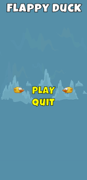

# Flappy-Duck
Android 2D game created using Unity 2017.3.1f1

      

---
## ToDo:
+ Add Main Menu and pause menu
+ ~~Fix ScoreText size and GameOverText size (dynamic?)~~
+ Implement levels - After a certain score, world will scroll faster and gaps will get more narrow.
+ Implement save progress and new game features
+ Tweak physics for more accurate flight projection