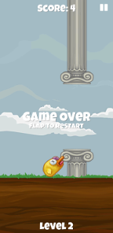

# Flappy-Duck
Android 2D game created using Unity 2017.3.1f1

      

---
## ToDo:
1. Add Main Menu and pause menu
2. Implement levels - After a certain score, world will scroll faster and gaps will get more narrow.
3. Implement save progress and new game features
4. Tweak physics for more accurate flight projection